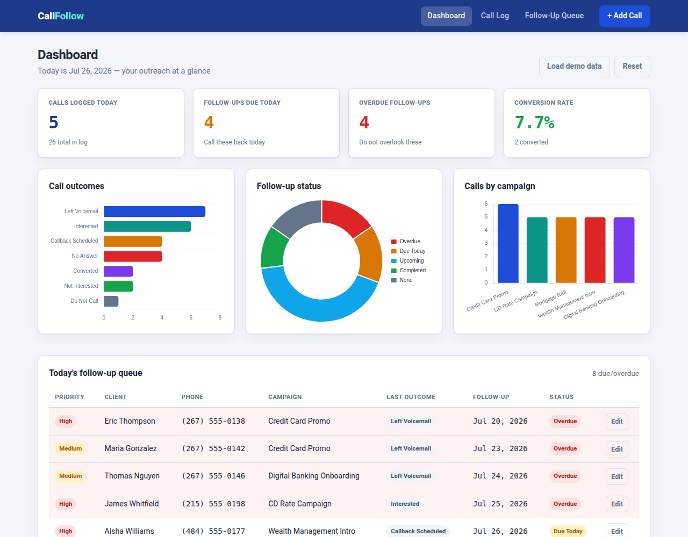
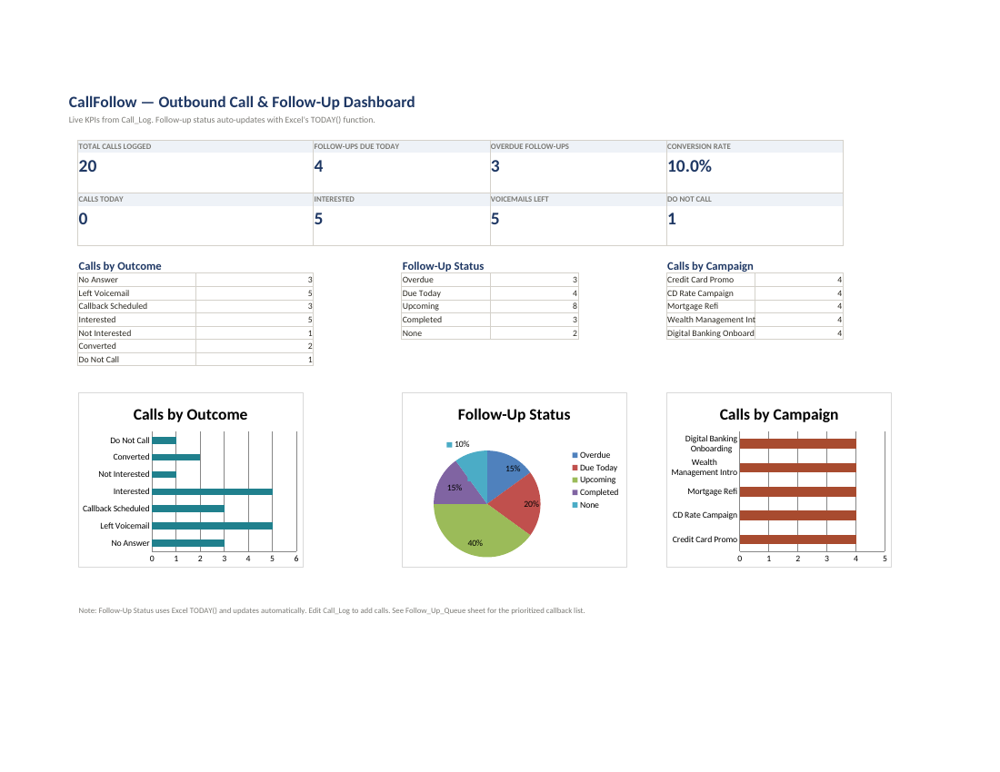
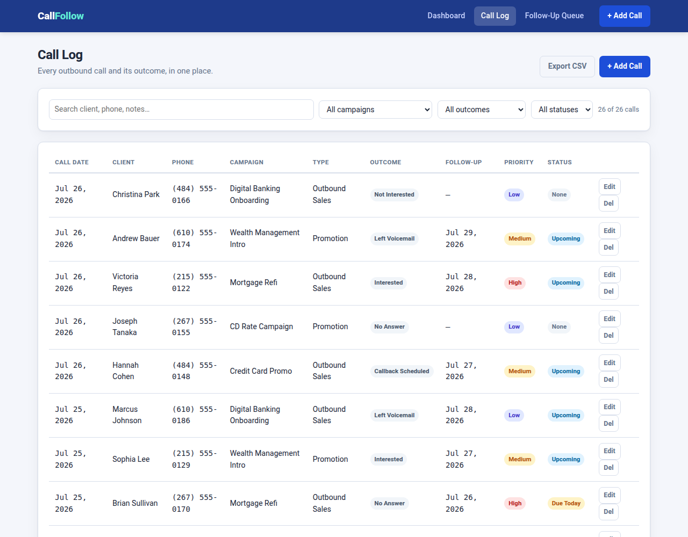

# FinTech_follwoUps_Tools
A lightweight tool that helps sales and service specialists never overlook a follow-up. Log outbound calls (promotions, campaigns, sales), capture the outcome, schedule a callback, and see exactly who needs to be contacted today — sorted by most overdue first.

# 📞 CallFollow

### Never miss a follow-up again.

A call tracking dashboard for sales & service specialists. Log outbound calls, schedule callbacks, and see exactly who needs to be contacted today — sorted by most overdue first.

Built to solve a real workplace problem: **when you're juggling dozens of callbacks, it's easy to overlook someone you promised to call back.** This tool makes sure that doesn't happen.

**HTML** · **CSS** · **JavaScript** · **Chart.js** · **Excel** · **openpyxl**

---

## The Problem

As a sales and service specialist making daily outbound calls — credit card promos, CD rate campaigns, mortgage refis, wealth management intros — I'd promise follow-up calls constantly. The problem? **With dozens of callbacks in flight, it was easy to overlook someone.**

> *As a specialist, I want to log every call and see a prioritized list of who I need to call back today — so no client falls through the cracks.*

**CallFollow** solves this with a live, auto-sorted follow-up queue that puts your most overdue callbacks at the top.

---

## Skills Demonstrated

This project showcases abilities relevant to a **business analyst / associate analyst** role:

- **Problem framing** — translating a real workflow pain point into a user story and tool
- **Data modeling** — designing a schema with derived fields and a status engine
- **Data visualization** — KPI dashboards, charts, conditional formatting
- **Excel analytics** — `COUNTIF`, `IF/OR`, `TODAY()`, cross-sheet references, pivot-style summaries
- **Front-end development** — HTML, CSS, vanilla JS, Chart.js, localStorage
- **Process improvement** — replacing ad-hoc tracking with a prioritized, auditable system

---
## Data Schema
Both the web app and Excel template share this exact schema (CSV is the bridge):

**Inspired by a Sales & Service Specialist workflow. Built to solve a real problem.**

